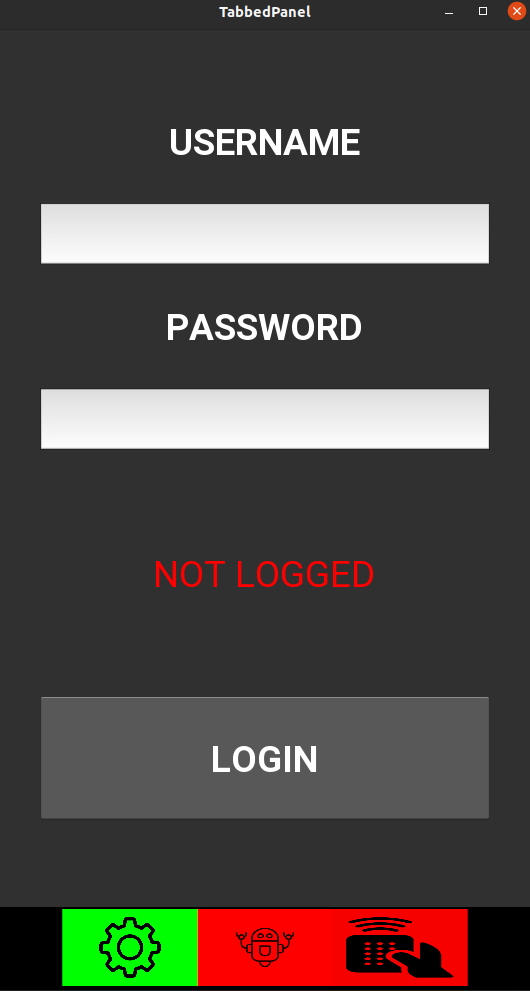
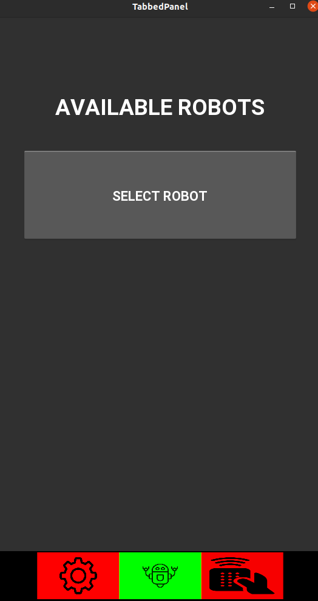
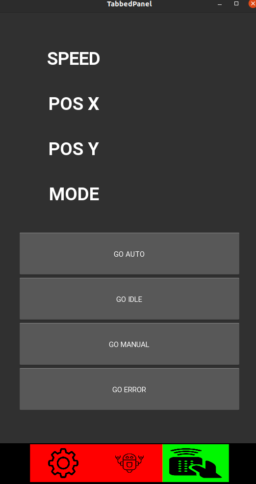

UNITED FRONT
============

Frontend application based on Kivy to monitor and control robots.

Rules:
  - user need to login in case to monitor/control robots.
  - user can select between robots that he got access
  - user can monitor robot/robots and switch their states.

What application does:
  - login user
  - get user robots
  - authenticate and connect to robot data socket
  - get data about robot and send commands to backend 
    (backend send command to robot via open channel)

Application contain three tabs:

**SETTINGS TAB**

On this tab user can login.

**ROBOTS TAB**

On this tab user can select one of his robots to monitor/control.
Dropdown will show available for user robots uuids.

**CONTROL TAB**

On this tab user can monitor/control selected robot.
User can use control buttons to switch robot states.

TODO
----
I got limited time so TODO list looks like that:
 - integration tests
 - GUI test
 - class refactor
 - creating better utils
 - adding more error context in messages
 - better UI look

BUILD ON ANDROID
---------------

It's kivy, so it can be build as Android package, pls check:
    
    https://buildozer.readthedocs.io/en/latest/

SETUP
-----

Install kivy:

    https://kivy.org/doc/stable/gettingstarted/installation.html

Create venv (use python version >= 3.8):

    $ python3.8 -m venv .venv
    $ source .venv/bin/activate

Install packages:

    $ pip install -r requirements.txt

COMMANDS
---------

Run:
    
    $ python app/main.py

Black:
    
    $ black -S -l 90 app/

